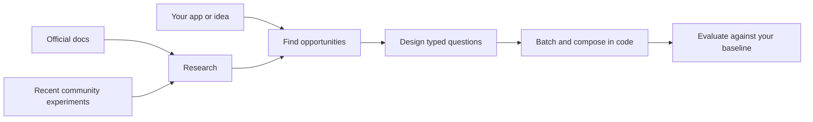

<p align="center">
  
</p>

<p align="center">
  <a href="https://thursdai.news"></a>
  <a href="https://docs.typesafe.ai"></a>
  <a href="LICENSE"></a>
</p>

<p align="center">
  <strong>Find where Jev belongs. Design the questions. Measure the difference.</strong><br />
  A reusable agent skill for any app, codebase, or idea.
</p>

<p align="center">
  <a href="#get-started">Get started</a> ·
  <a href="#what-people-are-building">Community examples</a> ·
  <a href="#three-primitives-many-possibilities">Question design</a> ·
  <a href="SKILL.md">Read the skill</a>
</p>

---

## Why Jevify?

Many LLM calls end with a tiny decision: choose a tool, keep a passage, flag a defect, rank a candidate. [TypeSafe Jev](https://typesafe.ai) makes those decisions through typed questions and probabilities, without generating a prose answer.

**The opportunity is doing useful work more often, across more candidates, with less waiting and lower cost.** An LLM can do many of the same tasks. Jevify helps you find where Jev's economics change what is practical, then design an honest comparison.

It combines **current TypeSafe documentation**, **community experiments from the past three days**, and **your application** to produce concrete question packs and integration ideas. It works with an existing repository or a plain-language description.

> Jevify is an independent skill from the ThursdAI community. It is not the Jev model, an API client, or an official TypeSafe product.

## Get started

Install with the [open agent skills CLI](https://github.com/vercel-labs/skills):

```bash
npx skills add altryne/jevify --skill jevify
```

Choose your agent when prompted. You can also give an agent this repository and ask it to read [SKILL.md](SKILL.md) and its linked references.

Then ask:

```text
Jevify this codebase. Find repeated LLM judgments or fragile semantic
heuristics that could benefit from Jev. Recommend the best opportunities,
write the actual questions, and propose a fair latency/cost/quality test.
```

No repository? Start with an idea:

```text
Use Jevify to design a memory selector for my assistant. Several memories
can be useful at once. Show the state, primitives, exact questions,
batching strategy, fallback behavior, and evaluation cases.
```

Or improve an existing design:

```text
Use Jevify to review these questions. Are the primitives right?
Rewrite ambiguous criteria, identify missing context, and show
which questions can run together.
```

**Requirements:** an agent that can read skill files and browse public docs. [last30days](https://github.com/mvanhorn/last30days-skill) is recommended for community research; the skill discloses when it falls back to public search. You need TypeSafe API access only when you choose to run inference. Installing the skill does not make API calls.

## What you get

| Deliverable | What's inside |
|---|---|
| **Opportunity map** | Where Jev, a hybrid, a generative model, or existing code fits best |
| **Question pack** | Exact state, instructions, criteria, primitive choices, and missing-data behavior |
| **Composition plan** | Shared-state batching, dependent stages, routing, source extraction, and fallback |
| **Evidence** | Original sources and dates, with measured results separated from demos and proposals |
| **Smallest useful experiment** | Boundary cases and a fair test of latency, total cost, quality, and coverage |

## What people are building

A few discoveries from **September 14–17, 2026**. These are examples of people using **Jev**, not claims that they used this skill. Results below are reported by the authors and were not reproduced here.

| Use case | Community example | Lesson for your app |
|---|---|---|
| **Writing checks while you work** | [Mike Taylor / Every](https://every.to/also-true-for-humans/mini-vibe-check-typesafe-s-jev-judged-everything-i-ve-written-in-0-7-seconds) reported 777 judgments across 37 documents in under 0.7 seconds. | Turn a rubric into separate checks; let the writing model revise flagged passages. |
| **Better agent memory selection** | [Aera's offline study](https://aerabrowser.com/news/agent-memory-doesnt-need-a-generator-typesafes-jev-vs-llm-on-400-real-tasks) tested Jev on 400 cases and found benefits from per-candidate judgments. | If several memories can help, ask a Noul for each rather than forcing one Choice winner. |
| **Routing to the right model** | [Taishi Morinaga / DevelopersIO](https://dev.classmethod.jp/articles/jev-for-llm-model-routing/) tested four difficulty tiers through Jev's Choice primitive. | Make routing a bounded decision; test borderline requests, not only obvious ones. |
| **Home Assistant questions as entities** | [AboveColin / HA-Jev](https://github.com/AboveColin/HA-Jev) connects household state to probabilities, choices, and scores. | Compute exact sensor comparisons in code; send meaningful context for the semantic judgment. |
| **Context-aware credential triage** | [teyhouse / jev-secret-detection](https://github.com/teyhouse/jev-secret-detection) evaluates synthetic credential and non-credential snippets. | Test false positives by category. A semantic check complements established scanners. |
| **Interactive idea scoring** | [A community builder's demo](https://www.reddit.com/r/SideProject/comments/1wiw6tk/i_built_a_side_project_to_test_typesafes_jev/) evaluates ideas across roughly ten parallel criteria. | Score distinct dimensions, then expose the weights and tradeoffs in code. |

**Speed is only half the story.** Every's small writing comparison found a missed defect; Aera's wider candidate pools could cost more. Different task sizes and reasoning settings change the comparison. The [full research notes](references/community-discoveries-2026-09-17.md) preserve methods, numbers, caveats, and sources.

The skill refreshes community research for new discovery work, so this snapshot is a starting point rather than a frozen list of possibilities.

## Three primitives, many possibilities

| Primitive | Ask | Use it for |
|---|---|---|
| **Choice** | “Which one?” | A handler, category, action, or source span |
| **Noul** | “Is this condition true?” | A defect, relevance check, or one of several applicable labels |
| **Score** | “How much, on this defined scale?” | Utility, severity, complexity, or another graded property |

A good question defines the decision boundary. “Is this good?” tells the model very little. “Does this passage supply a step or prerequisite needed to answer the query?” gives it a job.

### Example: keep every useful passage

One request, shared context, independent judgments. Both passages may be useful, so this uses two Nouls rather than a single Choice.

```json
{
  "model": "jev-1.13.0",
  "state": {
    "query": "How do I rotate an API key without downtime?",
    "passages": {
      "a": "Create a second key, migrate clients, then revoke the old key.",
      "b": "The service supports two active keys per project."
    }
  },
  "questions": {
    "keep_a": {
      "type": "noul",
      "instructions": "Does passages.a help answer query with a step, prerequisite, or constraint?"
    },
    "keep_b": {
      "type": "noul",
      "instructions": "Does passages.b help answer query with a step, prerequisite, or constraint?"
    }
  }
}
```

This is an illustrative native TypeSafe request body, not a recorded model result. Code applies a threshold validated on your data, keeps qualifying passages, and enforces the context budget. Question IDs are for your code; the target must also appear in the instructions. Check the [current model](https://docs.typesafe.ai/models) and [API contract](https://docs.typesafe.ai/api) before running.

Explore [three complete request examples](assets/example-requests.json), [nine boundary cases](assets/question-cases.json), and the [question-design guide](references/question-design.md).

## How it works



Jevify explores routing, retrieval, extraction, verification, document structure, entity matching, interactive decisions, and combinations of those patterns. It preserves exact calculations and hard rules in code, and keeps generative models where writing or deeper reasoning is needed.

## Inside the skill

| File | Purpose |
|---|---|
| [SKILL.md](SKILL.md) | The workflow your agent follows |
| [Question design](references/question-design.md) | Primitive selection, bad-to-better questions, batching, and pitfalls |
| [Patterns](references/patterns.md) | Compositions and links to official cookbooks |
| [Research protocol](references/research-protocol.md) | Refresh official docs and the last three days of community evidence |
| [Community discoveries](references/community-discoveries-2026-09-17.md) | Dated first-hand experiments and transferable lessons |
| [Product evidence](references/product-evidence.md) | Documented interface, limits, pricing, and source links |
| [Evaluation](references/evaluation.md) | Compare matched workloads, quality, latency, and total cost |
| [Examples](assets/example-requests.json) · [Cases](assets/question-cases.json) | Ready-to-adapt requests and evaluation seeds |

## From ThursdAI

Built by [Alex Volkov](https://github.com/altryne), from the conversations and experiments around **[ThursdAI](https://thursdai.news)**: the weekly AI show, podcast, and newsletter.

[Visit ThursdAI →](https://thursdai.news)

<!-- EPISODE_LINK: Add this week's Jev conversation here when the episode is published. -->

## Contribute a discovery

Tried something useful with Jev? [Open an issue](https://github.com/altryne/jevify/issues) or a PR with the original source, date, question shape, workload, result, and what failed. Reproducible experiments and better question designs are especially welcome. Use synthetic or public examples.

Thanks to [TypeSafe](https://typesafe.ai) for the model and documentation, [last30days](https://github.com/mvanhorn/last30days-skill) for community research, and the builders sharing their experiments.

[MIT licensed](LICENSE). Third-party findings remain attributed to their authors.
