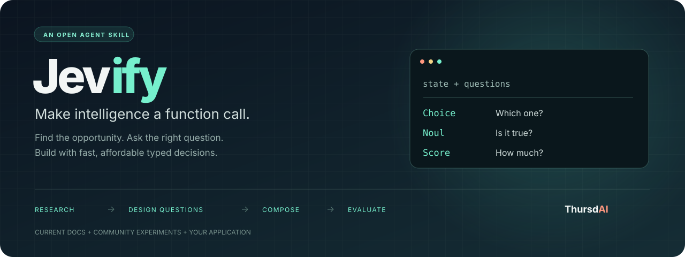
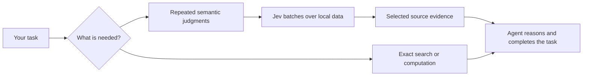

<p align="center">
  
</p>

<p align="center">
  <a href="https://thursdai.news"></a>
  <a href="https://docs.typesafe.ai"></a>
  <a href="LICENSE"></a>
</p>

<p align="center">
  <strong>Give your agent a System One capability.</strong><br />
  Use Jev during everyday agent work, and find what it can improve in your product.
</p>

<p align="center">
  <a href="#get-started">Get started</a> ·
  <a href="#what-people-are-building">Community examples</a> ·
  <a href="#three-primitives-many-possibilities">Question design</a> ·
  <a href="SKILL.md">Read the skill</a>
</p>

---

## Why Jevify?

An agent can have access to Jev and still read every document, load every tool result, and repeat every judgment itself. Jevify teaches it to recognize work that a fast, inexpensive decision model can handle, then gives it the tools to act.

[TypeSafe Jev](https://typesafe.ai) returns typed judgments and probabilities. It can select useful passages, rank candidates, check many items, or choose a handler. Jevify helps the agent send those decisions to Jev, bring selected source evidence into context, and continue reasoning toward your answer.

The agent's own reading and reasoning cost tokens too. Jevify makes Jev the default for bulk semantic judgments, assuming it is faster and cheaper than spending reasoning-model tokens on those judgments. The agent delegates the first pass, reads selected evidence, and finishes the task. It does not stop to build a cost comparison before using the tool.

There are two entry points:

- **Ordinary tasks:** a large document, noisy tool output, or repeated semantic checks can trigger Jevify even when you never mention Jev. The agent uses it where the task, available runtime, and external-inference permissions allow.
- **"Jevify this":** ask it to inspect a product or workflow and identify concrete improvements, including capabilities that frequent, inexpensive judgments could enable.

The skill teaches Choice, Noul, and Score, shared-state batching, question design, source preservation, and evaluation. Its Python helpers need no npm or third-party packages. Existing TypeSafe tools and official SDKs work too.

> Jevify is an independent skill from the ThursdAI community. It includes optional helper scripts; it is not the Jev model or an official TypeSafe product. Skill activation depends on the host agent, and installation does not intercept tool outputs automatically.

## Get started

Install with the [open agent skills CLI](https://github.com/vercel-labs/skills):

```bash
npx skills add altryne/jevify --skill jevify
```

The CLI asks which agents to install for (Claude Code, Codex, Cursor, and others) and whether to install for this project or globally. Common variations:

```bash
# Skip the prompts: install globally for Claude Code
npx skills add altryne/jevify --skill jevify -g -a claude-code -y

# See what the repository offers before installing
npx skills add altryne/jevify --list

# Later: check what is installed, pull the latest version, or uninstall
npx skills list
npx skills update
npx skills remove jevify
```

| Flag | Meaning |
|---|---|
| `-g`, `--global` | Install to your user directory so every project can use it, instead of the current project only |
| `-a`, `--agent <name>` | Target specific agents, for example `claude-code`, `codex`, or `cursor` |
| `-y`, `--yes` | Skip confirmation prompts |
| `--copy` | Copy the files instead of symlinking them |

`npx` comes with Node.js. Start a new agent session after installing so the skill is picked up. TypeSafe's own skill (`npx skills add typesafe-ai/skills`) also covers building, question design, composition, and verification. Jevify adds agent execution habits, runnable helpers, and proactive product opportunities; it does not require the other skill.

No CLI? Give an agent this repository and ask it to read [SKILL.md](SKILL.md) and its linked references.

For an ordinary task, ask normally:

```text
This report is long. Find the passages that explain migration failures,
rollback prerequisites, and exceptions, then answer with source references.
```

With the skill loaded and TypeSafe use authorized, the agent can scan before reading the full report into its reasoning context. It still checks original evidence before answering. For a product review, ask:

```text
Jevify this codebase. Find repeated LLM judgments or fragile semantic
heuristics that could benefit from Jev. Recommend the best opportunities,
write the actual questions, and explain how the result improves the experience.
```

No repository? Start with an idea:

```text
Use Jevify to design a memory selector for my assistant. Several memories
can be useful at once. Show the state, primitives, exact questions,
batching strategy, fallback behavior, and evaluation cases.
```

Or improve an existing design:

```text
Use Jevify to review these questions. Are the primitives right?
Rewrite ambiguous criteria, identify missing context, and show
which questions can run together.
```

**Requirements:** an agent that can read skill files and browse public docs. Live execution also needs a TypeSafe tool, SDK, or Python 3.10+ with outbound HTTPS for the bundled helpers. [last30days](https://github.com/mvanhorn/last30days-skill) is recommended for community research; the skill discloses when it falls back to public search. Installing the skill does not make API calls or grant permission to send data. Existing task or session authorization can cover repeated Jev calls without a separate request for each one.

A ready-to-run scan is available without package installation. Resolve `JEVIFY_DIR` to your installed skill directory, then run from your task directory:

```bash
python3 "$JEVIFY_DIR/scripts/scan.py" report.txt \
  --query "Migration failures and rollback requirements" --dry-run

python3 "$JEVIFY_DIR/scripts/scan.py" report.txt \
  --query "Migration failures and rollback requirements" \
  --output report-scan.json --top 8
```

The dry run needs no key or network. The live scan returns a compact reading shortlist and saves all judgments with source offsets. It supports plain UTF-8 text and JSONL records with a `text` field. It includes low-ranked and uncertain samples to check for missed evidence. For conversation archives, the [corpus review workflow](references/corpus-review.md) preserves roles, recurring concerns, and evidence through synthesis. The scan is a first pass, not an exhaustive review. See [agent workflows](references/agent-workflows.md) for reopening selected passages and handling large tool outputs.

**API key (only for live runs).** Create a key in the [TypeSafe console](https://console.typesafe.ai/settings/keys) and make it available as `TYPESAFE_API_KEY`, either exported in the shell that launches your agent or in a git-ignored `.env` in the project:

```bash
export TYPESAFE_API_KEY=...          # or: echo 'TYPESAFE_API_KEY=...' >> .env
```

Without a key the agent can keep working locally, design questions, and dry-run request sizing. It explains setup once instead of searching unrelated files for credentials.

## What you get

| Deliverable | What's inside |
|---|---|
| **Agent execution** | Scan local text or JSONL, inspect a compact shortlist with source locations, and finish the original task |
| **Opportunity map** | Where Jev, a hybrid, a generative model, or existing code fits best |
| **Question pack** | Exact state, instructions, criteria, primitive choices, and missing-data behavior |
| **Composition plan** | Shared-state batching, dependent stages, routing, source extraction, and fallback |
| **Evidence** | Original sources and dates, with measured results separated from demos and proposals |
| **Smallest useful experiment** | Boundary cases and a fair test of latency, total cost, quality, and coverage |

## What people are building

A few discoveries from **September 14–17, 2026**. These are examples of people using **Jev**, not claims that they used this skill. Results below are reported by the authors and were not reproduced here.

| Use case | Community example | Lesson for your app |
|---|---|---|
| **Writing checks while you work** | [Mike Taylor / Every](https://every.to/also-true-for-humans/mini-vibe-check-typesafe-s-jev-judged-everything-i-ve-written-in-0-7-seconds) reported 777 judgments across 37 documents in under 0.7 seconds. | Turn a rubric into separate checks; let the writing model revise flagged passages. |
| **Better agent memory selection** | [Aera's offline study](https://aerabrowser.com/news/agent-memory-doesnt-need-a-generator-typesafes-jev-vs-llm-on-400-real-tasks) tested Jev on 400 cases and found benefits from per-candidate judgments. | If several memories can help, ask a Noul for each rather than forcing one Choice winner. |
| **Routing to the right model** | [Taishi Morinaga / DevelopersIO](https://dev.classmethod.jp/articles/jev-for-llm-model-routing/) tested four difficulty tiers through Jev's Choice primitive. | Make routing a bounded decision; test borderline requests, not only obvious ones. |
| **Home Assistant questions as entities** | [AboveColin / HA-Jev](https://github.com/AboveColin/HA-Jev) connects household state to probabilities, choices, and scores. | Compute exact sensor comparisons in code; send meaningful context for the semantic judgment. |
| **Context-aware credential triage** | [teyhouse / jev-secret-detection](https://github.com/teyhouse/jev-secret-detection) evaluates synthetic credential and non-credential snippets. | Test false positives by category. A semantic check complements established scanners. |
| **Interactive idea scoring** | [A community builder's demo](https://www.reddit.com/r/SideProject/comments/1wiw6tk/i_built_a_side_project_to_test_typesafes_jev/) evaluates ideas across roughly ten parallel criteria. | Score distinct dimensions, then expose the weights and tradeoffs in code. |

**Speed is only half the story.** Every's small writing comparison found a missed defect; Aera's wider candidate pools could cost more. Different task sizes and reasoning settings change the comparison. The [full research notes](references/community-discoveries.md) preserve methods, numbers, caveats, and sources.

The skill refreshes community research for new discovery work, so this snapshot is a starting point rather than a frozen list of possibilities.

## Three primitives, many possibilities

| Primitive | Ask | Use it for |
|---|---|---|
| **Choice** | “Which one?” | A handler, category, action, or source span |
| **Noul** | “Is this condition true?” | A defect, relevance check, or one of several applicable labels |
| **Score** | “How much, on this defined scale?” | Utility, severity, complexity, or another graded property |

A good question defines the decision boundary. “Is this good?” tells the model very little. “Does this passage supply a step or prerequisite needed to answer the query?” gives it a job.

### Example: keep every useful passage

One request, shared context, independent judgments. Both passages may be useful, so this uses two Nouls rather than a single Choice.

```json
{
  "model": "jev-1.13.0",
  "state": {
    "query": "How do I rotate an API key without downtime?",
    "passages": {
      "a": "Create a second key, migrate clients, then revoke the old key.",
      "b": "The service supports two active keys per project."
    }
  },
  "questions": {
    "keep_a": {
      "type": "noul",
      "instructions": "Does `passages.a` help answer `query` with a step, prerequisite, or constraint?"
    },
    "keep_b": {
      "type": "noul",
      "instructions": "Does `passages.b` help answer `query` with a step, prerequisite, or constraint?"
    }
  }
}
```

This is an illustrative native TypeSafe request body, not a recorded model result. Code applies a threshold validated on your data, keeps qualifying passages, and enforces the context budget. Question IDs are for your code; the target must also appear in the instructions, as a backticked state path. Check the [current model](https://docs.typesafe.ai/models) and [API contract](https://docs.typesafe.ai/api) before running.

Explore [three complete request examples](assets/example-requests.json), [nine boundary cases](assets/question-cases.json), a [complete worked question pack](references/worked-question-pack.md), and the [question-design guide](references/question-design.md).

Have an API key? Check the shapes for free, then run the examples:

```bash
python scripts/run_cases.py --dry-run
TYPESAFE_API_KEY=... python scripts/run_cases.py
```

A live run bills your TypeSafe account and sends the request state to TypeSafe.

## How it works



For product work, Jevify also identifies improvements, designs questions, and tests the resulting behavior against the current approach. Current TypeSafe docs guide the implementation. Community experiments help with open-ended discovery. Exact calculations and hard rules stay in code; generation and deeper reasoning stay with the appropriate model.

## Inside the skill

| File | Purpose |
|---|---|
| [SKILL.md](SKILL.md) | The workflow your agent follows |
| [Agent workflows](references/agent-workflows.md) | Scan documents and tool outputs before bulk reading; retrieve selected source evidence |
| [Question design](references/question-design.md) | Primitive selection, bad-to-better questions, batching, and pitfalls |
| [Patterns](references/patterns.md) | Compositions and links to official cookbooks |
| [Research protocol](references/research-protocol.md) | Refresh official docs and recent community evidence, widening the window when it is quiet |
| [Community discoveries](references/community-discoveries.md) | Dated snapshots of first-hand experiments and transferable lessons |
| [Worked question pack](references/worked-question-pack.md) | One complete deliverable, from decision to composition code and thresholds |
| [Product evidence](references/product-evidence.md) | Documented interface, response shape, context window, weaknesses, pricing, and source links |
| [Evaluation](references/evaluation.md) | Compare matched workloads, quality, latency, and total cost |
| [Examples](assets/example-requests.json) · [Cases](assets/question-cases.json) | Ready-to-adapt requests and evaluation seeds |
| [Running Jev](references/running-jev.md) | Runtime choice, credentials, batching, failures, and caching |
| [Field notes](references/field-notes.md) | Historical examples to consult when a similar failure appears |
| [scan.py](scripts/scan.py) | Standard-library relevance scan for local text and JSONL, with compact output and source locations |
| [jev_client.py](scripts/jev_client.py) | Standard-library client: key loading, concurrent requests over reused connections, pacing, and retries |
| [run_cases.py](scripts/run_cases.py) | Validate request bodies, then send them concurrently and print answers, tokens, and cost |
| [evals/](evals/evals.json) | Test prompts for checking changes to the skill itself |

## From ThursdAI

Built by [Alex Volkov](https://github.com/altryne), from the conversations and experiments around **[ThursdAI](https://thursdai.news)**: the weekly AI show, podcast, and newsletter.

[Visit ThursdAI →](https://thursdai.news)

<!-- EPISODE_LINK: Add this week's Jev conversation here when the episode is published. -->

## Contribute a discovery

Tried something useful with Jev? [Open an issue](https://github.com/altryne/jevify/issues) or a PR with the original source, date, question shape, workload, result, and what failed. Reproducible experiments and better question designs are especially welcome. Use synthetic or public examples.

**Maintaining the skill.** Keep it portable: no install paths, private project paths, tickets, credentials, transcripts, or one project's rules inside the skill folder. Add new research as a dated snapshot at the top of [community-discoveries.md](references/community-discoveries.md) and keep each snapshot small. When the TypeSafe docs change, update the verified date and facts in [product-evidence.md](references/product-evidence.md), including the price and limits in `scripts/run_cases.py`. Run the prompts in [evals/evals.json](evals/evals.json) before and after a change; Compare the same agent without Jevify, with TypeSafe's official skill, and with Jevify. Test ordinary tasks that never name Jev, as well as explicit product reviews. Skill discovery and execution after loading are separate outcomes.

Thanks to [TypeSafe](https://typesafe.ai) for the model and documentation, [last30days](https://github.com/mvanhorn/last30days-skill) for community research, and the builders sharing their experiments.

[MIT licensed](LICENSE). Third-party findings remain attributed to their authors.
